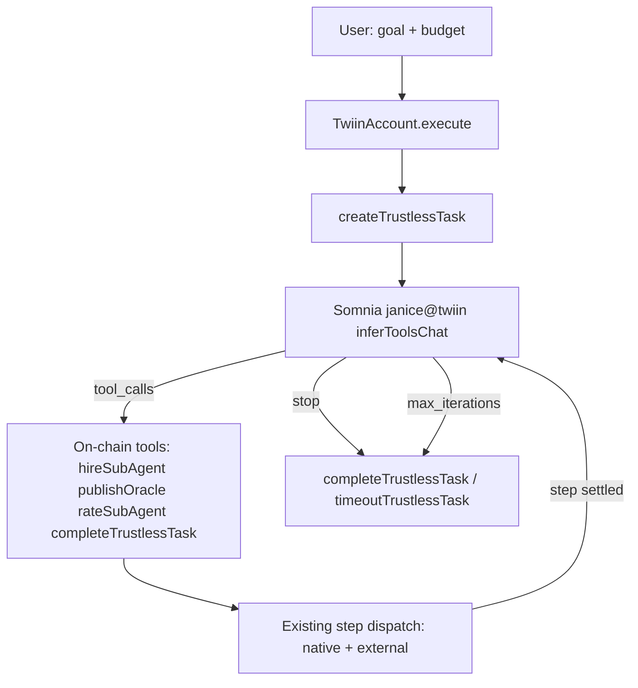

# Phase 5 Plan — TrustlessJanice (with Phases 1–4 Audit)

> **Date:** 2026-06-06  
> **Status:** Planning — Phase 4 gaps deferred; start Phase 5 at Gate 0 (T2/T3/T4)  
> **Related:** [Master spec](../../docs/twiin.md) · [Detailed implementation plan](./plans/2026-06-04-phase-5-trustless-janice.md)

## Overview

Audit confirms Phases 1–4 are demo-ready with minor open checks (E1, stale docs, deferred UI gaps). Phase 5 adds TrustlessJanice end-to-end behind feature flags, starting with Gate 0 (T2/T3/T4 measurement) before contract work.

---

## Phases 1–4 Audit Summary

### Phase 1 — Contracts: **Complete** (1 open check)

| Item | Status |
|------|--------|
| 11 contracts + mocks/interfaces | Done |
| 91/91 Hardhat tests | Done |
| Somnia deploy → `packages/shared/addresses.json` | Done |
| `PlanMode` enum + dual policy caps in `packages/contracts/src/AgentPolicy.sol` | Done (scaffolding only) |
| **E1:** `submitExternalResult` gas confirmed | **Open** — script exists at `packages/contracts/scripts/measure-submit-external-result.ts`; checklist in `docs/twiin.md` still `[ ]` |

**Verdict:** Not blocking Phase 5. Run E1 when convenient (low priority).

---

### Phase 2 — Shared Package: **Complete**

| Item | Status |
|------|--------|
| ABIs, types, `addresses.json` | Done |
| `CHAIN_ID`, `TWIIN_6551_SALT`, config/capability IDs | Done |
| `buildTwiinDigest()`, `deriveTwiinAccountAddress()` | Done |
| 22/22 parity tests | Done |
| `PlanMode.TrustlessJanice = 1`, `NativeConfigId.JANICE`, `CapabilityId.PLAN_TRUSTLESS` | Done in `packages/shared/constants.ts` |

**Verdict:** No gaps. Phase 5 adds new encode helpers after contract changes.

---

### Phase 3 — Backend: **Complete** (1 intentional omission)

| Checklist item | Status | Evidence |
|----------------|--------|----------|
| Shared-package-only imports | Done | `@twiin/shared` throughout |
| Contract clients + indexer | Done | `apps/backend/src/keepers/indexer.ts` |
| External verification + relay | Done | `keepers/relay.ts`, `keepers/externals.ts` boot at startup |
| Claude planner (ClaudePlan only) | Done | `apps/backend/src/routes/plan.ts` |
| Rating + timeout keepers | Done | `keepers/rater.ts`, `keepers/timeouts.ts` |
| Budget guard ($2 warn / $0.50 hard stop) | Done | `apps/backend/src/budget.ts` — **stale** in `build-context.md` |
| SSE stream | Done | `apps/backend/src/sse.ts` |
| `OracleRefreshWorker` | **Not built** | Intentional per spec §0 — chain-side Reactivity is primary |

**Verdict:** Demo path works. Phase 5 adds trustless keeper + optional preflight route.

---

### Phase 4 — Frontend: **Demo-ready** (~90%, gaps deferred)

| Checklist item | Status | Notes |
|----------------|--------|-------|
| Wallet connect + wrong-chain banner | Done | `components/layout/NetworkBanner.tsx` |
| `DeployAgent` / `deployTwiin` | Done | `components/agents/DeployAgentPanel.tsx` |
| ClaudePlan only; TrustlessJanice hidden | Done | No trustless references in frontend |
| 60s plan approval + 6551 `createTask` | Done | `PlanApproval.tsx`, `useCreateTask.ts` |
| Live execution (SSE + chain) | Done | `useTaskStream.ts`, console transcript |
| Result receipts | Done | `TaskResultCard.tsx` |
| Policy panel (kill switch, caps, `subscribePull`) | Done | `PolicyPanel.tsx` — **stale** gap note in `build-context.md` |
| External agent registration UI | Done | `ExternalAgentPanel.tsx` |
| Marketplace / leaderboard | Done | `MarketplacePage.tsx` |
| Oracle feed panel (`/feeds`) | **Removed** | Intentional UI redesign — oracle data shown in console/task results instead |
| `wallet_addEthereumChain` fallback | **Missing** | Only `switchChain` in `useNetworkGuard.ts` |
| AgentProfile NFT page | **Missing** | No `/agent/:id` route |
| Frontend tests | **Missing** | No vitest under `apps/frontend/` |
| Stale docs | **Drift** | `apps/frontend/CLAUDE.md` still lists `FeedsPage`; `docs/ui-requirements.md` still requires Feeds route |

**Verdict:** ClaudePlan E2E demo is shippable. All Phase 4 gaps **deferred** — not blocking Phase 5.

---

### Bonus: Discord Bot (post-hoc Phase 5 in root CLAUDE.md)

`apps/discord-bot` is complete — demo external HTTP sub-agent. Independent of TrustlessJanice.

---

## Phase 5 Blockers (must resolve before enabling toggle)

From `docs/twiin.md` §18 and §0:

| Gate | Status | What to measure |
|------|--------|-----------------|
| **T2** | Open | `maxIterations` overflow behavior on Agents API proxy `0x037Bb9…` |
| **T3** | Open | Per-iteration gas budget for `handleResponse` tool round-trips |
| **T4** | Open | STT charged per `inferToolsChat` iteration vs single request |

T1 and T5 are already resolved. **No TrustlessJanice code ships to users until Gate 0 results are documented.**

Existing detailed plan: [plans/2026-06-04-phase-5-trustless-janice.md](./plans/2026-06-04-phase-5-trustless-janice.md)

---

## Phase 5 Architecture

**Key constraint:** ClaudePlan path in `packages/contracts/src/AgentOrchestrator.sol` (`createTask` + `_advance`) must remain untouched. TrustlessJanice adds a parallel Janice loop state machine.

**Locked design decisions** (from existing plan — do not re-litigate):

- **D1:** Resume `inferToolsChat` **on-chain** in `handleResponse`; keeper is watchdog-only
- **D2:** `hireSubAgent` appends one step, reuses `_dispatchStep`
- **D3:** Trustless tasks complete only via `completeTrustlessTask` or timeout/abort — not when step list empties
- **D6:** Feature flags default **false**: `VITE_ENABLE_TRUSTLESS_JANICE`, `ENABLE_TRUSTLESS_JANICE`
- **D8:** `/api/plan` stays ClaudePlan-only — trustless uses separate entrypoint

---

## Implementation Sequence (5 PRs)

### PR 1 — Gate 0: `gate-trustless-metrics` (~0.5–1 day)

**Create:**

- `packages/contracts/scripts/measure-trustless-janice.ts` — calls live Agents API on Somnia with `inferToolsChat`, `maxIterations` ∈ {1, 2, 8}
- `docs/plans/2026-06-04-trustless-janice-gate-results.md` — concrete T2/T3/T4 numbers

**Exit criteria:**

- T2 overflow behavior documented (revert data / `finishReason`)
- T3 gas per tool round-trip measured
- T4 STT balance delta per iteration measured
- `MAX_JANICE_ITERATIONS` and budget preflight multiplier updated from results

**Add npm script:** `measure:trustless-janice` in contracts `package.json`

---

### PR 2 — Contracts: `contracts-trustless-janice` (~2–4 days, critical path)

**Modify:** `packages/contracts/src/AgentOrchestrator.sol`

1. **Storage + events:** `TrustlessCtx` mapping, `JaniceIteration`, `JaniceToolExecuted`
2. **`createTrustlessTask`:** Same 6551 auth as `createTask`; `PlanMode.TrustlessJanice`; first `agentsApi.createRequest` to Janice (`NativeConfigId.JANICE` / agent `12847293847561029384`)
3. **Tool functions** (`onlyJaniceLoop` modifier): `hireSubAgent`, `publishOracle`, `rateSubAgent`, `completeTrustlessTask`, `timeoutTrustlessTask`
4. **`handleTrustlessJaniceResponse`:** Decode `inferToolsChat` result; dispatch tool_calls; resume or abort on `max_iterations`
5. **`_advance` integration:** On trustless step settle, call `_resumeJanice` instead of `_completeTask`

**Create:** `packages/contracts/test/TrustlessJanice.test.ts`  
**Modify:** `packages/contracts/src/mocks/MockAgentsApi.sol` — simulate `tool_calls` then `stop`

**Exit criteria:**

- Happy path: create → hireSubAgent → step complete → completeTrustlessTask
- Policy cap enforcement (`maxPerTaskWeiTrustless`)
- `timeoutTrustlessTask` after deadline
- `maxIterations` abort
- Existing `OrchestratorTask.test.ts` regression passes

---

### PR 3 — Shared + Backend: `backend-trustless-keeper` (~1–2 days)

**Shared** (`packages/shared/`):

- `JANICE_SOMNIA_AGENT_ID`, `MAX_JANICE_ITERATIONS` (from Gate 0)
- `encodeCreateTrustlessTask({ personalAgentId, goal, budgetWei })`
- Parity test additions in `test/parity.test.ts`
- Regenerate ABIs via `pnpm compile && copy-abis`

**Backend** (`apps/backend/`):

- `ENABLE_TRUSTLESS_JANICE` in `src/env.ts`
- New `src/keepers/trustless.ts` — watchdog: `timeoutTrustlessTask` on deadline; stuck-loop detection
- Optional `src/routes/trustless-preflight.ts` — budget estimate + calldata (no Claude)
- Indexer SSE for `JaniceIteration` / `JaniceToolExecuted` in `keepers/indexer.ts`
- Tests in `apps/backend/test/trustless-preflight.test.ts`

---

### PR 4 — Frontend: `frontend-trustless-console` (~1 day)

**Create:**

- `apps/frontend/src/config/features.ts` — `trustlessJaniceEnabled`
- `hooks/useCreateTrustlessTask.ts` — 6551-wrapped `createTrustlessTask`
- `components/console/TrustlessPreflightCard.tsx`

**Modify:**

- `ConsolePage.tsx` — plan mode toggle (only when flag true); no 60s approval for trustless; attestation badge
- `PolicyPanel.tsx` — allow editing `maxPerTaskTrustless` when flag enabled

**Exit criteria:** Toggle invisible when `VITE_ENABLE_TRUSTLESS_JANICE=false`. ClaudePlan flow unchanged.

---

### PR 5 — Deploy + E2E: `deploy-somnia-trustless` (~0.5 day)

1. `pnpm test` (contracts) + `pnpm test:all`
2. `pnpm deploy:somnia` — Orchestrator bytecode changed
3. Refresh `packages/shared/addresses.json` + `START_BLOCK`
4. Manual E2E with flags enabled locally:
   - Connect → funded agent → Console → Trustless → goal + budget → submit
   - Observe SSE: Janice iterations, hired steps, completion
   - Verify oracle output in task result (no `/feeds` — deferred)
   - Disable flag → ClaudePlan still works

---

## Implementation Checklist

- [ ] **PR1:** Create `measure-trustless-janice.ts`, run on Somnia testnet, document T2/T3/T4 in `gate-results.md`
- [ ] **PR2:** Implement `createTrustlessTask`, Janice tools, `handleTrustlessJaniceResponse`, `_advance` integration + `TrustlessJanice.test.ts`
- [ ] **PR3:** Regenerate ABIs, add shared encode helpers, backend trustless keeper + optional preflight + indexer SSE
- [ ] **PR4:** Feature flags, `useCreateTrustlessTask`, `TrustlessPreflightCard`, ConsolePage toggle (hidden by default)
- [ ] **PR5:** Redeploy Somnia, refresh addresses, manual E2E with flags on, verify ClaudePlan regression
- [ ] **Doc sync:** Update `build-context.md`, CLAUDE.md files, `twiin.md` checklists

---

## Doc Sync (low-effort, do alongside PR 5)

Update stale references:

- `build-context.md` — remove false gaps (PolicyPanel, BudgetGuard); mark Phase 5 in progress
- `CLAUDE.md` — Phase 6 TrustlessJanice status
- `apps/frontend/CLAUDE.md` — remove FeedsPage references
- `docs/twiin.md` — check E1 when measured; add Gate 0 results link

---

## Risk Register

| Risk | Mitigation |
|------|------------|
| Conversation bytes too large for chain | Store hash on-chain; pass full `updatedMessages` in next `createRequest` payload |
| T4 pricing exceeds budget | Preflight enforces `budget >= janiceCost × (MAX_ITERATIONS + 1)` from Gate 0 |
| `handleResponse` gas limit | T3 measurement; split resume if needed |
| MockAgentsApi ≠ real API | Gate 0 testnet smoke before enabling flag |
| Redeploy breaks demo addresses | One-command `deploy:somnia` + documented pinned addresses |

---

## Estimated Effort

| Slice | Days |
|-------|------|
| Gate 0 (T2/T3/T4) | 0.5–1 |
| Contracts + tests | 2–4 |
| Shared + Backend | 1–2 |
| Frontend | 1 |
| Deploy + E2E | 0.5 |
| **Total** | **5–8 focused days** |

Contracts are the critical path. Frontend scaffolding can start against mock ABI after Gate 0, in parallel with contract tests.

---

## What We Are NOT Doing (v1 Phase 5)

Per spec and deferred Phase 4 decision:

- Restoring `/feeds` route
- AgentProfile NFT page
- `wallet_addEthereumChain` fallback
- Frontend vitest suite
- `OracleRefreshWorker` backend fallback
- Enabling TrustlessJanice toggle in production demo until Gate 0 doc is committed
