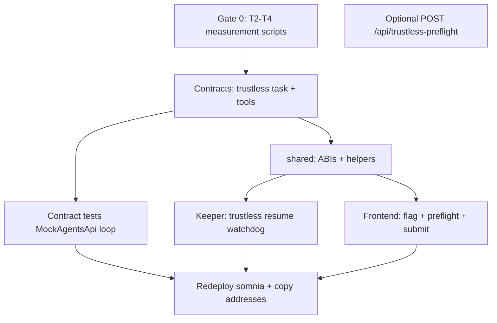

# Phase 5 — TrustlessJanice Implementation Plan

> **For agentic workers:** Implement task-by-task. Check boxes as you go. Do not enable the user-facing toggle until **Gate 0** (T2–T4) is documented.

**Goal:** Add `PlanMode.TrustlessJanice` end-to-end: user submits intent + budget via 6551 `execute`, Somnia validators run `janice@twiin` (`inferToolsChat`), orchestrator executes Janice’s on-chain tools (`hireSubAgent`, `publishOracle`, `rateSubAgent`, `completeTrustlessTask`), existing step machinery runs sub-agents, UI shows trustless flow behind a feature flag.

**Architecture:** Reuse `AgentOrchestrator` task lock, vault, policy (`maxPerTaskWeiTrustless`), registry, and native/external dispatch. Add a parallel **Janice loop** state on trustless tasks: `createTrustlessTask` opens the first `agentsApi.createRequest` to configId `0`; `handleResponse` decodes `inferToolsChat` results, runs `onlyJaniceLoop` tool functions, and either resumes Janice (another `createRequest`) or completes via `completeTrustlessTask`. ClaudePlan path stays untouched.

**Tech stack:** Solidity 0.8.30 (Hardhat), `@twiin/shared`, Hono backend keeper, React/wagmi frontend, Somnia Agents API (`0x037Bb9…` proxy on 50312), `MockAgentsApi` for local tests.

**Status today (audit 2026-06-04):**

| Layer | TrustlessJanice |
|-------|----------------|
| Contracts | `PlanMode` enum + policy cap only — **no** `createTrustlessTask` or tool fns |
| `@twiin/shared` | `PlanMode.TrustlessJanice = 1`, `NativeConfigId.JANICE`, `CapabilityId.PLAN_TRUSTLESS` |
| Backend | ClaudePlan `/api/plan` only |
| Frontend | Policy read shows trustless cap; console is Claude-only |
| Gates T2–T4 | Open per `docs/twiin.md` §18 |

---

## Dependency graph



**Parallelizable after Gate 0:** contract tests (C2) and frontend UI scaffolding (F1 with mocked calldata) can start against a branch ABI before testnet deploy.

---

## Design decisions (lock before coding)

| # | Decision | Recommendation |
|---|----------|----------------|
| D1 | Where does `inferToolsChat` resume live? | **On-chain in `handleResponse`** for tool_calls: execute tools, then `createRequest` again with `updatedMessages` from callback payload. Optional **keeper watchdog** only for `timeoutTrustlessTask` and stuck loops (no resume logic off-chain). |
| D2 | `hireSubAgent` semantics | Append one `Step` + `StepRuntime`, set `cursor` to that step, call existing `_dispatchStep`. On step settle, if `mode == TrustlessJanice` and Janice pending, **do not** `_completeTask` when `cursor == steps.length`; instead signal Janice resume. |
| D3 | Task completion | Trustless tasks complete **only** via `completeTrustlessTask` (Janice tool) or `timeoutTrustlessTask` / `_abortTask` — not when step list empties unless Janice explicitly completes. |
| D4 | `intentPayload` encoding | `abi.encode(string goal)` or JSON `{"goal":"..."}` — pick one in shared constants; frontend/backend must match. |
| D5 | Janice inference cost | First request ~0.24 STT (registry cost × subcommittee + deposit). Budget must reserve **iteration premium** (T4 outcome drives multiplier). Until T4 measured, UI warns “may use up to N × 0.24 STT”. |
| D6 | Feature flags | `VITE_ENABLE_TRUSTLESS_JANICE=false` default; backend `ENABLE_TRUSTLESS_JANICE=false`. No toggle in production demo until gate doc committed. |
| D7 | Redeploy | Orchestrator bytecode changes → `pnpm deploy:somnia`, refresh `packages/shared/addresses.json`, verify `startBlock` for keepers. |
| D8 | `plan.trustless` in Claude planner | Keep **excluded** from `/api/plan` (configId 0 forbidden today) — trustless uses separate entrypoint only. |

---

## Gate 0 — Measure T2–T4 (required before mainnet demo toggle)

**Files:**

- Create: `packages/contracts/scripts/measure-trustless-janice.ts`
- Create: `docs/plans/2026-06-04-trustless-janice-gate-results.md` (fill with numbers)

- [ ] **Step 1:** Script calls live Agents API proxy `0x037Bb9C718F3f7fe5eCBDB0b600D607b52706776` on Somnia RPC with agent `12847293847561029384`, `inferToolsChat`, `maxIterations` ∈ {1,2,8}, dummy `onchainTools` matching orchestrator selectors.
- [ ] **Step 2:** Record **T2** — behavior when `maxIterations` exceeded (`finishReason`, revert data).
- [ ] **Step 3:** Record **T3** — gas used per tool round-trip (cast estimate or receipt).
- [ ] **Step 4:** Record **T4** — STT charged per iteration vs single request (balance delta on keeper/account).
- [ ] **Step 5:** Update plan § Budget defaults and `MAX_JANICE_ITERATIONS` constant from results.

**Exit:** `gate-results.md` has concrete numbers; CLAUDE.md Phase 6 row can cite them.

---

## Phase 5.1 — Contracts (`packages/contracts`)

### Task 1: Trustless task storage + events

**Files:**

- Modify: `src/AgentOrchestrator.sol`
- Modify: `src/TwiinTypes.sol` (if new enums needed, e.g. `JanicePhase`)

- [ ] Add `struct TrustlessCtx { uint256 janiceRequestId; uint8 iterations; uint8 maxIterations; bool awaitingJanice; bytes conversationHash; }` (minimize storage — store conversation blob hash on-chain, full messages in event or off-chain indexer if too large).
- [ ] `mapping(uint256 => TrustlessCtx) trustlessCtx`
- [ ] Events: `JaniceIteration(uint256 taskId, uint8 n, string finishReason)`, `JaniceToolExecuted(uint256 taskId, bytes4 selector)`

### Task 2: `createTrustlessTask`

- [ ] `function createTrustlessTask(uint256 personalAgentId, bytes calldata intentPayload, uint256 budgetWei) external payable returns (uint256 taskId)`
- [ ] Auth: same as `createTask` — `msg.sender == _twiinAccount(personalAgentId)`, `msg.value == budgetWei`
- [ ] `policy.validateAndReserveTaskBudget(PlanMode.TrustlessJanice, ...)`, vault lock, `taskLock`, `mode = TrustlessJanice`, `deadline = now + TASK_DEADLINE`
- [ ] Build initial `inferToolsChat` payload (goal from `intentPayload`, system prompt hash/skeleton per spec §7)
- [ ] Register `onchainTools`: `hireSubAgent(...)`, `publishOracle(...)`, `rateSubAgent(...)`, `completeTrustlessTask(...)` ABI strings
- [ ] `agentsApi.createRequest{value: janiceCost}(JANICE_SOMNIA_ID, address(this), handleTrustlessJaniceResponse.selector, payload)` — use `NativeConfigId.JANICE` somnia id from deployment manifest
- [ ] Emit `TaskCreated(..., PlanMode.TrustlessJanice, ...)`

### Task 3: Janice tool functions (`onlyJaniceLoop`)

Modifier: `onlyJaniceLoop` — `msg.sender == address(agentsApi)` AND active trustless task AND `trustlessCtx[taskId].awaitingJanice == false` (reentrancy guard).

- [ ] `hireSubAgent(taskId, configId, payload)` — registry checks, append step, `_dispatchStep`, set `awaitingStep = true`
- [ ] `publishOracle(...)` — delegate to existing internal publish path (same as oracle step)
- [ ] `rateSubAgent(taskId, configId, score)` — `agentRegistry` Elo update path (or defer to existing finalize if external)
- [ ] `completeTrustlessTask(taskId)` — `_completeTask` with result string
- [ ] `timeoutTrustlessTask(taskId)` — permissionless after `deadline`

### Task 4: `handleTrustlessJaniceResponse`

- [ ] New callback `handleTrustlessJaniceResponse(...)` **or** branch in `handleResponse` when `tasks[ref.taskId].mode == TrustlessJanice`
- [ ] Decode validator `responses[0].result` per Somnia `inferToolsChat` return schema (see `somnia-agentation.md` §5.2)
- [ ] If `finishReason == stop` → auto `completeTrustlessTask` or require explicit complete (spec says tool exists — prefer explicit)
- [ ] If `tool_calls` → decode calldata, dispatch to `hireSubAgent` / `publishOracle` / `rateSubAgent` / `completeTrustlessTask`
- [ ] If `max_iterations` → `_abortTask`
- [ ] Increment `iterations`; require `<= MAX_JANICE_ITERATIONS` (8)
- [ ] On step completion for trustless child steps: resume Janice with `updatedMessages` (fund next `createRequest` from task budget)

### Task 5: Integrate `_advance` with trustless

- [ ] When trustless task’s hired step finishes, do not complete task if Janice loop active
- [ ] Callback into `_resumeJanice(taskId, toolResults)`

### Task 6: Hardhat tests

**Files:**

- Create: `test/TrustlessJanice.test.ts`
- Modify: `src/mocks/MockAgentsApi.sol` — simulate `tool_calls` then `stop` payloads

- [ ] Deploy fixture with janice config 0
- [ ] `createTrustlessTask` happy path: hireSubAgent → mock native step → completeTrustlessTask
- [ ] Policy: budget > `maxPerTaskWeiTrustless` reverts
- [ ] `timeoutTrustlessTask` after deadline
- [ ] `maxIterations` abort
- [ ] ClaudePlan regression: existing `OrchestratorTask.test.ts` still passes

### Task 7: ABI export

- [ ] `pnpm compile && pnpm copy-abis` (or repo script)
- [ ] Update `packages/shared` exports if new helpers needed (`encodeCreateTrustlessTask`, `JANICE_SOMNIA_AGENT_ID`)

---

## Phase 5.2 — Shared package

**Files:**

- Modify: `packages/shared/constants.ts`
- Modify: `packages/shared/index.ts` (encode helpers)
- Create: `packages/shared/trustless.ts` (optional — intent encode, tool signatures)

- [ ] `export const JANICE_SOMNIA_AGENT_ID = 12847293847561029384n` (from manifest)
- [ ] `export const MAX_JANICE_ITERATIONS = 8`
- [ ] `encodeCreateTrustlessTask({ personalAgentId, goal, budgetWei })`
- [ ] `export const TRUSTLESS_ONCHAIN_TOOLS = [...]` (ABI signature strings for docs/tests)
- [ ] Parity test in `packages/shared/test/parity.test.ts`

---

## Phase 5.3 — Backend

### Task 8: Env + feature flag

**Files:**

- Modify: `apps/backend/src/env.ts`

- [ ] `ENABLE_TRUSTLESS_JANICE: BoolFromEnv.default(false)`

### Task 9: Trustless keeper / watchdog

**Files:**

- Create: `apps/backend/src/keepers/trustless.ts`
- Modify: `apps/backend/src/index.ts` (start if flag)
- Create: `apps/backend/src/lib/trustless-orion.ts` (viem read tasks, call `timeoutTrustlessTask`, optional stuck detection)

- [ ] Index `TaskCreated` with `mode == TrustlessJanice`
- [ ] Poll task state; if `Running` past deadline → `timeoutTrustlessTask`
- [ ] SSE events: `janice_iteration`, `janice_tool` (map from new contract events in indexer)

### Task 10: Optional preflight API

**Files:**

- Create: `apps/backend/src/routes/trustless-preflight.ts`

- [ ] `POST /api/trustless-preflight` — validate goal length, estimate min budget (janice cost × iterations from Gate 0), return `createTrustlessTask` calldata + orchestrator address
- [ ] Guard with `ENABLE_TRUSTLESS_JANICE` and `PLAN_SECRET` pattern (reuse plan auth if desired)
- [ ] **Do not** call Claude for planning in trustless mode

### Task 11: Indexer SSE

**Files:**

- Modify: `apps/backend/src/keepers/indexer.ts`

- [ ] Emit SSE for Janice events so Console timeline works

### Task 12: Backend tests

- [ ] `apps/backend/test/trustless-preflight.test.ts` (mocked RPC)

---

## Phase 5.4 — Frontend

### Task 13: Feature flag + config

**Files:**

- Create: `apps/frontend/src/config/features.ts`
- Modify: `apps/frontend/.env.example` (document `VITE_ENABLE_TRUSTLESS_JANICE`)

```ts
export const trustlessJaniceEnabled =
  import.meta.env.VITE_ENABLE_TRUSTLESS_JANICE === 'true'
```

### Task 14: `useCreateTrustlessTask` hook

**Files:**

- Create: `apps/frontend/src/hooks/useCreateTrustlessTask.ts`

- [ ] Mirror `useCreateTask`: `twiinAccount.execute(orchestrator, budget, encodeFunctionData(createTrustlessTask, ...))`
- [ ] Parse `TaskCreated` log; set `activeTaskId`

### Task 15: `TrustlessPreflightCard` + Console integration

**Files:**

- Create: `apps/frontend/src/components/console/TrustlessPreflightCard.tsx`
- Modify: `apps/frontend/src/pages/ConsolePage.tsx`

- [ ] Plan mode toggle: ClaudePlan | TrustlessJanice (only if `trustlessJaniceEnabled`)
- [ ] Trustless path: no `PlanApproval` countdown; show preflight (budget, trustless cap, latency warning, attestation copy)
- [ ] Submit → `useCreateTrustlessTask` (optional preflight fetch first)
- [ ] Reuse `TaskTimeline` + `TaskResult`; badge “Validator consensus · Janice”
- [ ] Kill switch + low balance checks (reuse existing)
- [ ] Hide toggle when flag false (no dead UI)

### Task 16: Policy panel trustless cap edit

**Files:**

- Modify: `apps/frontend/src/components/agents/PolicyPanel.tsx`

- [ ] Allow editing `maxPerTaskTrustless` when flag enabled (pass to `setPolicy`)

### Task 17: Docs + CLAUDE.md

- [ ] `twiin/CLAUDE.md` Phase 6 → in progress / complete
- [ ] `build-context.md` Phase 5 row
- [ ] README demo path adds optional trustless bullet

---

## Phase 5.5 — Deploy & E2E

### Task 18: Redeploy Somnia testnet

- [ ] `pnpm test` (contracts)
- [ ] `pnpm deploy:somnia`
- [ ] Copy manifests to `packages/shared`
- [ ] Restart backend keepers with new `START_BLOCK`

### Task 19: Manual E2E checklist

- [ ] Connect wallet, agent unfrozen, TBA funded (≥2 STT for trustless cap)
- [ ] Enable flags locally
- [ ] Console → Trustless → goal “Daily Somnia sentiment oracle” → submit
- [ ] Observe SSE + explorer: Janice request, hireSubAgent steps, completion
- [ ] Feeds page shows published oracle (if goal implies publish)
- [ ] Toggle off → ClaudePlan still works

---

## Risk register

| Risk | Mitigation |
|------|------------|
| Conversation bytes too large for chain storage | Store keccak hash on-chain; pass full `updatedMessages` in next `createRequest` payload from last event via indexer/keeper cache |
| T4 pricing higher than budget | Preflight enforces `budget >= janiceCost * (MAX_ITERATIONS+1)`; Gate 0 sets constant |
| `handleResponse` gas limit | Measure T3; reduce on-chain tools or split resume across txs if needed |
| Redeploy breaks hackathon judges | Document pinned addresses; one-command `deploy:somnia` |
| MockAgentsApi ≠ real inferToolsChat | Gate 0 on testnet + one smoke test before enabling flag |

---

## Out of scope (v1 Phase 5)

- Trustless **reactivity refresh** (spec: out of scope)
- `reportBadSignature`
- Vault deposit/withdraw UI
- User post-task star rating tx
- Full `AgentProfile` NFT page (Phase 4 gap, separate)
- Replacing ClaudePlan as default

---

## Suggested PR split (5 PRs)

1. **gate-trustless-metrics** — scripts + results doc only  
2. **contracts-trustless-janice** — orchestrator + tests + ABIs  
3. **backend-trustless-keeper** — keeper, SSE, optional preflight  
4. **frontend-trustless-console** — flag, UI, hook  
5. **deploy-somnia-trustless** — addresses + README (after review)

---

## Estimated effort

| Slice | Effort |
|-------|--------|
| Gate 0 | 0.5–1 day |
| Contracts + tests | 2–4 days |
| Backend | 1–2 days |
| Frontend | 1 day |
| E2E + deploy | 0.5 day |

**Total:** ~5–8 focused days; contracts are the critical path.

---

## References

- Spec: `docs/twiin.md` §7 (PlanMode), §5 (janice config), §19 Phase 5, §18 T2–T4  
- Somnia API: `somnia-agentation.md` §5.2 `inferToolsChat`  
- Existing orchestrator: `packages/contracts/src/AgentOrchestrator.sol`  
- Deployed janice: `packages/shared/deployments/somniaTestnet.json` → `nativeAgents[0]`
